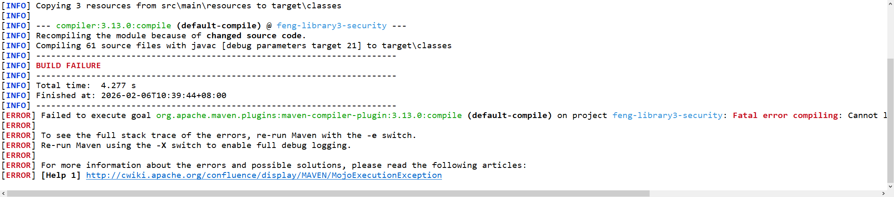
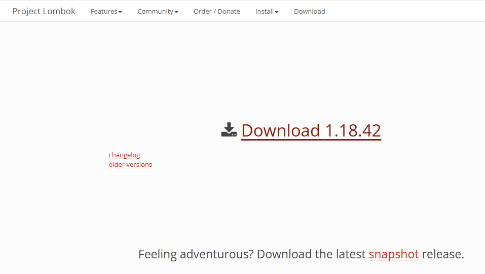
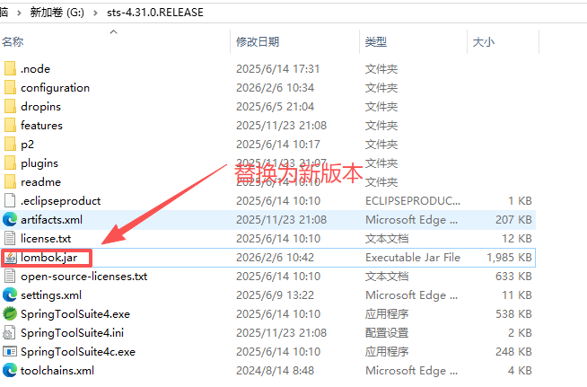
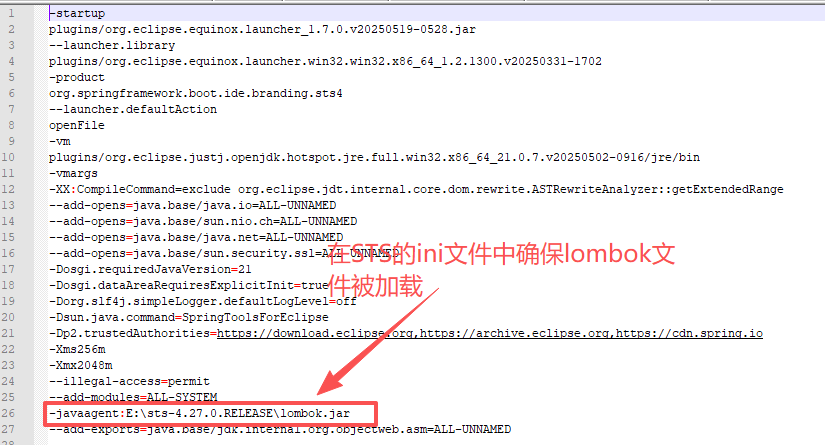

### 错误：

```
Fatal error compiling: Cannot load from object array because "this.hashes" is null
```

### 详细：

```
[INFO] Scanning for projects...
[INFO] 
[INFO] ----------------< ltd.huntinginfo:feng-library3-security >-----------------
[INFO] Building feng-library3-security 1.0.0-SNAPSHOT
[INFO]   from pom.xml
[INFO] --------------------------------[ jar ]---------------------------------
[INFO] 
[INFO] --- resources:3.3.1:resources (default-resources) @ feng-library3-security ---
[INFO] Copying 3 resources from src\main\resources to target\classes
[INFO] 
[INFO] --- compiler:3.13.0:compile (default-compile) @ feng-library3-security ---
[INFO] Recompiling the module because of changed source code.
[INFO] Compiling 61 source files with javac [debug parameters target 21] to target\classes
[INFO] ------------------------------------------------------------------------
[INFO] BUILD FAILURE
[INFO] ------------------------------------------------------------------------
[INFO] Total time:  4.277 s
[INFO] Finished at: 2026-02-06T10:39:44+08:00
[INFO] ------------------------------------------------------------------------
[ERROR] Failed to execute goal org.apache.maven.plugins:maven-compiler-plugin:3.13.0:compile (default-compile) on project feng-library3-security: Fatal error compiling: Cannot load from object array because "this.hashes" is null -> [Help 1]
[ERROR] 
[ERROR] To see the full stack trace of the errors, re-run Maven with the -e switch.
[ERROR] Re-run Maven using the -X switch to enable full debug logging.
[ERROR] 
[ERROR] For more information about the errors and possible solutions, please read the following articles:
[ERROR] [Help 1] http://cwiki.apache.org/confluence/display/MAVEN/MojoExecutionException
```



### 分析：

这是一个非常典型的 Lombok 与 JDK 21 不兼容 导致的编译错误。

错误信息 Fatal error compiling: Cannot load from object array because "this.hashes" is null 是 Lombok 旧版本在 JDK 21 下运行时的已知 Bug。

### 解决：

确保 feng-cloud3 父工程或 feng-library3-security 中的 Lombok 版本 至少为 1.18.30。强烈建议使用最新的 1.18.42。








在父项目POM文件中：

```
            <lombok.version>1.18.42</lombok.version>

            <dependency>
                <groupId>org.projectlombok</groupId>
                <artifactId>lombok</artifactId>
                <version>${lombok.version}</version>
            </dependency>
```

在子项目中：

```
        <!--Lombok-->
        <dependency>
            <groupId>org.projectlombok</groupId>
            <artifactId>lombok</artifactId>
            <scope>provided</scope>
        </dependency>
```